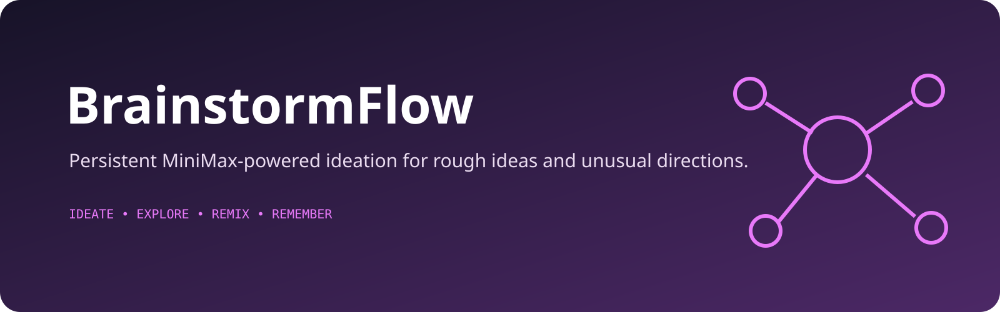

<p align="center">
  
</p>

# BrainstormFlow

BrainstormFlow is a MiniMax M3-powered ideation workspace for exploring rough ideas, creative directions, and unusual prompts in a persistent chat-style interface.

Instead of a blank note-taking canvas, it gives you a conversation loop: start a brainstorm, keep the session history, and trigger quick creative modes from a responsive single-page workspace.

## What it does

- Keeps multiple brainstorm sessions in local storage
- Turns free-form prompts into exploratory conversations
- Includes shortcut modes such as pattern hunt, wild mode, future scan, and mood board prompts
- Renders MiniMax M3 responses in Markdown
- Works as a responsive single-page app with sidebar session history

## Use Cases

- Explore product concepts before writing specs
- Break creative blocks with structured prompt shortcuts
- Stress-test an idea from several angles
- Generate rough directions for design, writing, strategy, or naming

## Quick Start

Prerequisites:

- Node.js
- A MiniMax API or Token Plan key exposed as `MINIMAX_API_KEY`

Install dependencies:

```bash
npm install
```

Run with PowerShell:

```powershell
$env:MINIMAX_API_KEY="your_key"
npm run dev
```

Run with a POSIX shell:

```bash
MINIMAX_API_KEY=your_key npm run dev
```

Then open the local Vite URL shown in the terminal.

## Security Note

BrainstormFlow is currently a browser-only prototype. Vite injects `MINIMAX_API_KEY` into the client bundle, so anyone who can load a deployed build can inspect the key. Use this setup only for trusted local testing. A public deployment should move MiniMax requests behind a server-side proxy.

Local `.env` files are ignored by Git. Never commit an API key.

## How It Works

The app stores sessions in `localStorage`, sends the full session history and BrainstormFlow system prompt to MiniMax's OpenAI-compatible Chat Completions API, and uses the `MiniMax-M3` model for responses.

## Project Structure

- `App.tsx` — main UI, session management, quick commands
- `services/minimaxService.ts` — MiniMax M3 API integration
- `services/minimaxService.test.ts` — provider contract and error tests
- `components/` — Markdown rendering and UI pieces
- `constants` / `types` — prompt configuration and shared models

## Status

Experimental prototype. Intended for solo use and fast idea exploration rather than team collaboration or production workflows.
